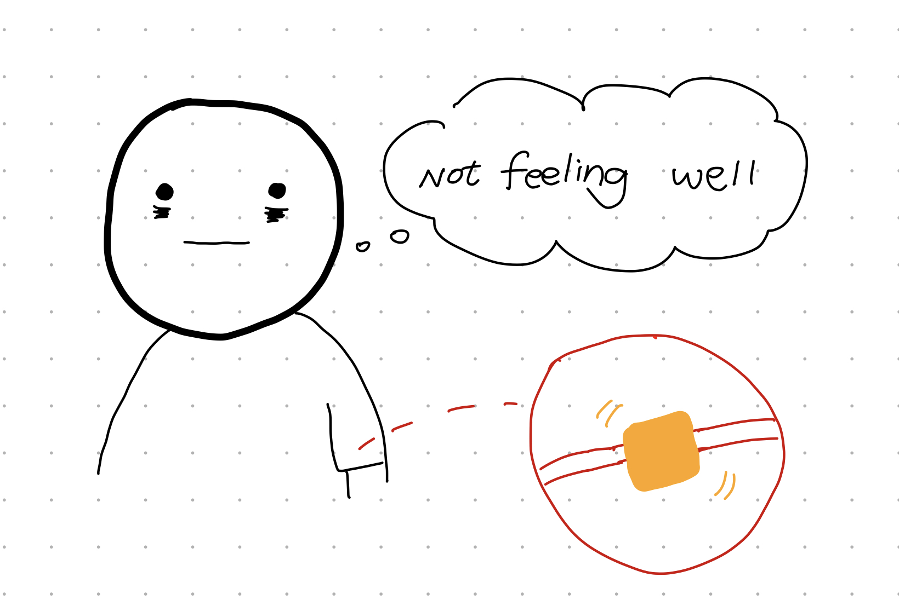
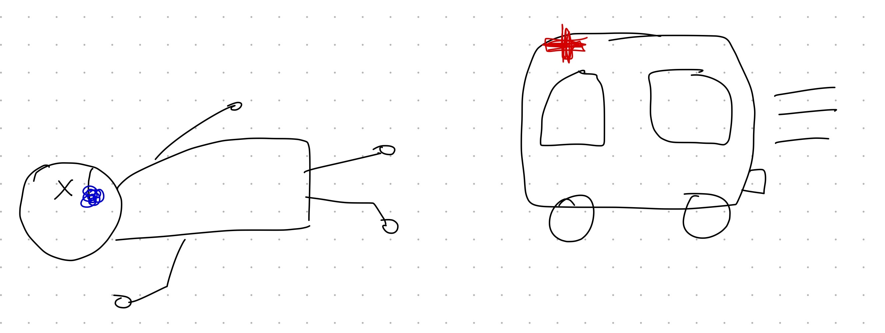
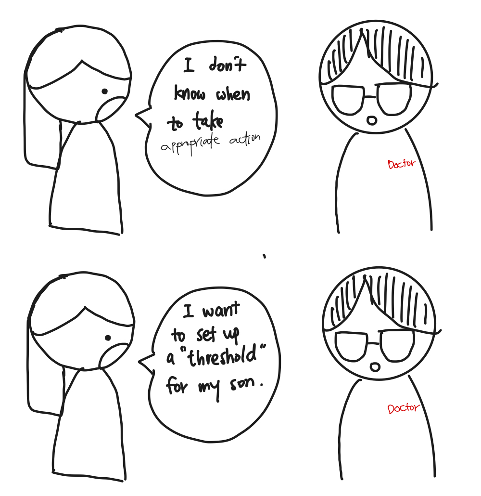
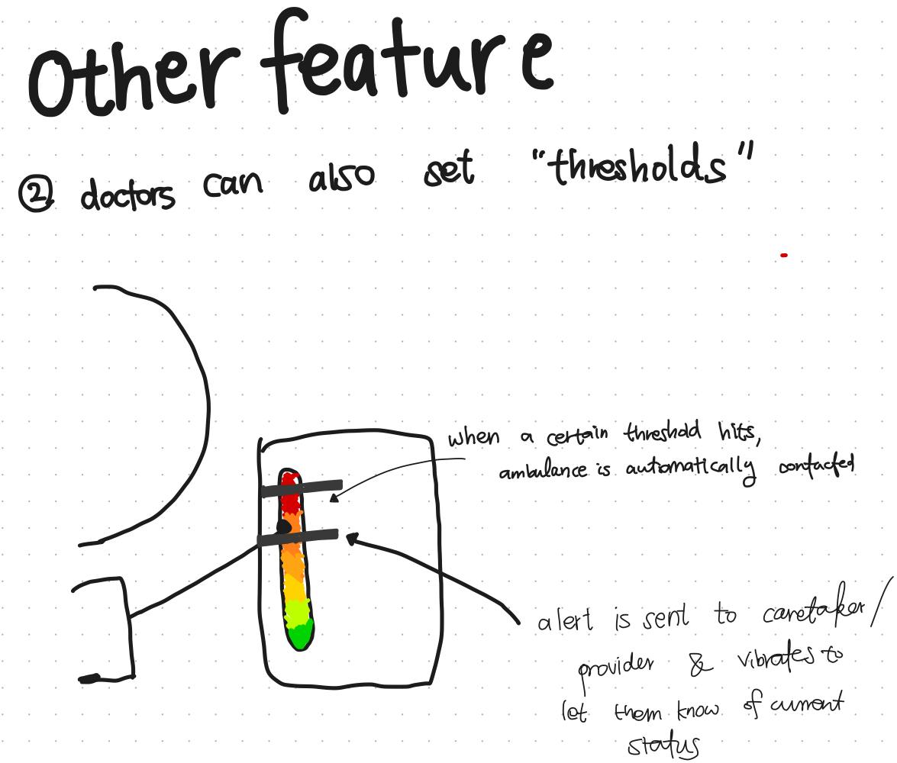
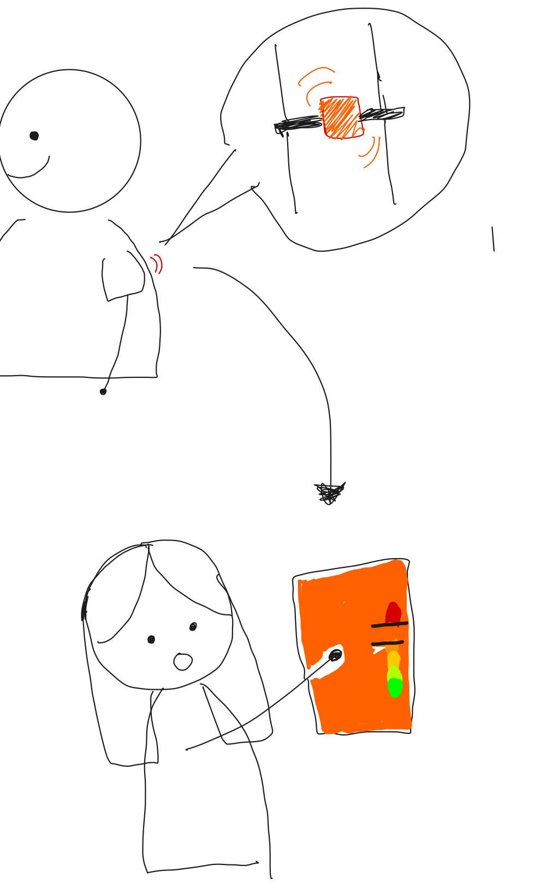
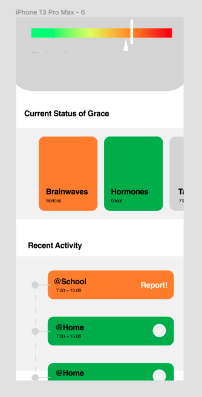

# Staging Interaction

In the original stage production of Peter Pan, Tinker Bell was represented by a darting light created by a small handheld mirror off-stage, reflecting a little circle of light from a powerful lamp. Tinkerbell communicates her presence through this light to the other characters. See more info [here](https://en.wikipedia.org/wiki/Tinker_Bell). 

There is no actor that plays Tinkerbell--her existence in the play comes from the interactions that the other characters have with her.

For lab this week, we draw on this and other inspirations from theatre to stage interactions with a device where the main mode of display/output for the interactive device you are designing is lighting. You will plot the interaction with a storyboard, and use your computer and a smartphone to experiment with what the interactions will look and feel like. 

_Make sure you read all the instructions and understand the whole of the laboratory activity before starting!_

## Prep

### To start the semester, you will need:
1. Read about Git [here](https://git-scm.com/book/en/v2/Getting-Started-What-is-Git%3F).
2. Set up your own Github "Lab Hub" repository to keep all you work in record by [following these instructions](https://github.com/FAR-Lab/Developing-and-Designing-Interactive-Devices/blob/2021Fall/readings/Submitting%20Labs.md).
3. Set up the README.md for your Hub repository (for instance, so that it has your name and points to your own Lab 1) and [learn how to](https://guides.github.com/features/mastering-markdown/) organize and post links to your submissions on your README.md so we can find them easily.

### For this lab, you will need:
1. Paper
2. Markers/ Pens
3. Scissors
4. Smart Phone -- The main required feature is that the phone needs to have a browser and display a webpage.
5. Computer -- We will use your computer to host a webpage which also features controls.
6. Found objects and materials -- You will have to costume your phone so that it looks like some other devices. These materials can include doll clothes, a paper lantern, a bottle, human clothes, a pillow case, etc. Be creative!

### Deliverables for this lab are: 
1. 7 Storyboards
1. 3 Sketches/photos of costumed devices
1. Any reflections you have on the process
1. Video sketch of 3 prototyped interactions
1. Submit the items above in the lab1 folder of your class [Github page], either as links or uploaded files. Each group member should post their own copy of the work to their own Lab Hub, even if some of the work is the same from each person in the group.

### The Report
This README.md page in your own repository should be edited to include the work you have done (the deliverables mentioned above). Following the format below, you can delete everything but the headers and the sections between the **stars**. Write the answers to the questions under the starred sentences. Include any material that explains what you did in this lab hub folder, and link it in your README.md for the lab.

## Lab Overview
For this assignment, you are going to:

A) [Plan](#part-a-plan) 

B) [Act out the interaction](#part-b-act-out-the-interaction) 

C) [Prototype the device](#part-c-prototype-the-device)

D) [Wizard the device](#part-d-wizard-the-device) 

E) [Costume the device](#part-e-costume-the-device)

F) [Record the interaction](#part-f-record)

Labs are due on Mondays. Make sure this page is linked to on your main class hub page.

## Part A. Plan 

**Setting**

While technology has created massive opportunities in health care and health tech, there are still a lot of unprovided services that people need to better cope with health problems. One problem that still needs to be addressed is patients do not have the resources to check their health and parents/guardians/providers/doctors cannot reach out to help them if the patients are in a critical state.

This product is a small device that a patient can wear to keep track of their hormonal or stress levels. Parents or doctors can also have a hold onto one of these devices so that they too can also be notified of any important changes in the status of a patient's health. If a patient is in a critical state, the device will notify the person at the other end of the device immediately with lights and audio, and will also provide directions to the location of the patient.

_Setting:_ The household, hospital, school, in the streets, Anywhere with good connection. 

_Players:_ The patient that needs to have their hormonal levels/stress levels tracked, health care providers, doctors, and parents. 

_Activity:_ When the device detects spikes in their hormones or stress levels, the information will be relayed to their health care providers and their parents so that immediate action could be taken. Colors in a spectrum of red and green will indicate the patient's current status (Red for bad and green for good) and parents can check whether or not the patient is exposed to certain health threats. When a patient is in a critical state or is in danger of being exposed to a health threat, the device provides audio and light alarms to notify the guardian. It will also provide directions to the location of the patient so that they can quickly find the patient.

_Goals:_ There are two ulterior goals for this device. The first is to check and be notified of the current status of the patient. The second is to be able to find the patient swiftly when they are in danger.

**Storyboard** 

**Feedback**

Very good idea. Maybe think of developing this as an idea for Product Studio

## Part B. Act out the Interaction

The interaction was done on an Apple Watch and the iPhone. 
The real thing would have been done on a little device much smaller than the Apple Watch. It was kind of difficult having to attach an Apple Watch to your arm.

While acting out the scene, I realized that the device for the parent should be a bit bigger than the device that the child had because I realized that because this device held such valuable information, it had to be easily found, accessed, and used.  

## Part C. Prototype the device

I used the tinkerbelle to control the colors from green to red.. 
The code was edited so that we were only presented with red-green swatches.
I also embedded a picture on Google Maps to the phone just to give it the idea that the phone was giving directions to the location of the patient.

I think the idea of creating a unique, creative prototype that makes use of lights and audio was a great approach to having us think about the interaction that we really wanted to bring. I was challenged to think about unique interactions (clicking, swiping, shaking, tracking, etc.) that could bring forth actual value to the user. 

I think that the instructions were unclear and people were struggling to understand what was to be expected of the assignment.

## Part D. Wizard the device

https://user-images.githubusercontent.com/49267393/187288476-2695ba02-35a0-4e24-af1a-6800f36536c4.mp4

Now, hange the goal within the same setting, and update the interaction with the paper prototype. 

\*\***Show the follow-up work here.**\*\*

## Part E. Costume the device

Look was inspired by the Apple Watch. 
I've designed the chip to be small so that it wouldn't bother the user with their everyday routines. 
It has a keychain hanger on the top so that you can don't lose it. 

## Part F. Record

https://user-images.githubusercontent.com/49267393/187292992-80777550-b584-4865-b0bf-361961a84021.mp4

# Staging Interaction, Part 2 

This describes the second week's work for this lab activity.

## Prep (to be done before Lab on Wednesday)

You will be assigned three partners from another group. Go to their github pages, view their videos, and provide them with reactions, suggestions & feedback: explain to them what you saw happening in their video. Guess the scene and the goals of the character. Ask them about anything that wasn’t clear. 

**Received Feedback** 

The feedback I received were all positive.
So in order to enhance some features, I had to talk with my mom and my sister. 

The reason why I got feedback frmo these two people are because they are the ones who were directly affected by this. 

One thing that my mom was always scared of was not being able to reach my sister on time, when she has unprecedented spasms or strokes. 

She thought that a good feature to add was if the device alerted the guardian, doctor, and the patient when sugar levels/brain waves hormones are at abnormal levels

**Video** 

In order to enact the following storyboard scenes, I had to set up the iPad and the desktop. 

After setting up the environment, i realized that it would be better to make an interface for the doctor and the mother. This would allow more intuitive communication between mother and doctor.   

I quickly set up a Figma rough wireframe / low-fidelity prototype that would illustrate the app. 

Here is the finished reenactment

https://user-images.githubusercontent.com/49267393/192922296-3cb9693e-4bed-46da-9a6a-bb18823742b7.mp4

