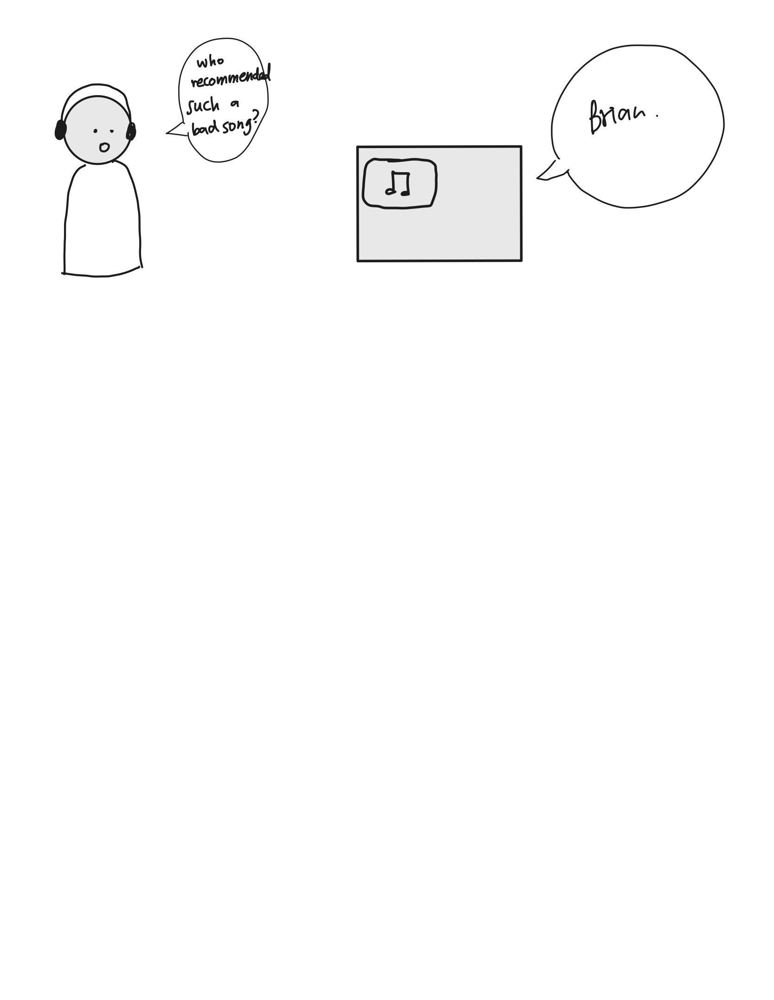

# Chatterboxes
**NAMES OF COLLABORATORS HERE**
[](https://www.youtube.com/embed/Q8FWzLMobx0?start=19)

In this lab, we want you to design interaction with a speech-enabled device--something that listens and talks to you. This device can do anything *but* control lights (since we already did that in Lab 1).  First, we want you first to storyboard what you imagine the conversational interaction to be like. Then, you will use wizarding techniques to elicit examples of what people might say, ask, or respond.  We then want you to use the examples collected from at least two other people to inform the redesign of the device.

We will focus on **audio** as the main modality for interaction to start; these general techniques can be extended to **video**, **haptics** or other interactive mechanisms in the second part of the Lab.

## Prep for Part 1: Get the Latest Content and Pick up Additional Parts 

### Pick up Web Camera If You Don't Have One

Students who have not already received a web camera will receive their [IMISES web cameras](https://www.amazon.com/Microphone-Speaker-Balance-Conference-Streaming/dp/B0B7B7SYSY/ref=sr_1_3?keywords=webcam%2Bwith%2Bmicrophone%2Band%2Bspeaker&qid=1663090960&s=electronics&sprefix=webcam%2Bwith%2Bmicrophone%2Band%2Bsp%2Celectronics%2C123&sr=1-3&th=1) on Thursday at the beginning of lab. If you cannot make it to class on Thursday, please contact the TAs to ensure you get your web camera. 

### Get the Latest Content

As always, pull updates from the class Interactive-Lab-Hub to both your Pi and your own GitHub repo. There are 2 ways you can do so:

**\[recommended\]**Option 1: On the Pi, `cd` to your `Interactive-Lab-Hub`, pull the updates from upstream (class lab-hub) and push the updates back to your own GitHub repo. You will need the *personal access token* for this.

```
pi@ixe00:~$ cd Interactive-Lab-Hub
pi@ixe00:~/Interactive-Lab-Hub $ git pull upstream Fall2022
pi@ixe00:~/Interactive-Lab-Hub $ git add .
pi@ixe00:~/Interactive-Lab-Hub $ git commit -m "get lab3 updates"
pi@ixe00:~/Interactive-Lab-Hub $ git push
```

Option 2: On your your own GitHub repo, [create pull request](https://github.com/FAR-Lab/Developing-and-Designing-Interactive-Devices/blob/2022Fall/readings/Submitting%20Labs.md) to get updates from the class Interactive-Lab-Hub. After you have latest updates online, go on your Pi, `cd` to your `Interactive-Lab-Hub` and use `git pull` to get updates from your own GitHub repo.

## Part 1.

### Text to Speech 

In this part of lab, we are going to start peeking into the world of audio on your Pi! 

We will be using the microphone and speaker on your webcamera. In the home directory of your Pi, there is a folder called `text2speech` containing several shell scripts. `cd` to the folder and list out all the files by `ls`:

```
pi@ixe00:~/text2speech $ ls
Download        festival_demo.sh  GoogleTTS_demo.sh  pico2text_demo.sh
espeak_demo.sh  flite_demo.sh     lookdave.wav
```

You can run these shell files by typing `./filename`, for example, typing `./espeak_demo.sh` and see what happens. Take some time to look at each script and see how it works. You can see a script by typing `cat filename`. For instance:

```
pi@ixe00:~/text2speech $ cat festival_demo.sh 
#from: https://elinux.org/RPi_Text_to_Speech_(Speech_Synthesis)#Festival_Text_to_Speech

echo "Just what do you think you're doing, Dave?" | festival --tts
```

Now, you might wonder what exactly is a `.sh` file? Typically, a `.sh` file is a shell script which you can execute in a terminal. The example files we offer here are for you to figure out the ways to play with audio on your Pi!

You can also play audio files directly with `aplay filename`. Try typing `aplay lookdave.wav`.

\*\***Write your own shell file to use your favorite of these TTS engines to have your Pi greet you by name.**\*\*
(This shell file should be saved to your own repo for this lab.)

Bonus: If this topic is very exciting to you, you can try out this new TTS system we recently learned about: https://github.com/rhasspy/larynx

### Speech to Text

Now examine the `speech2text` folder. We are using a speech recognition engine, [Vosk](https://alphacephei.com/vosk/), which is made by researchers at Carnegie Mellon University. Vosk is amazing because it is an offline speech recognition engine; that is, all the processing for the speech recognition is happening onboard the Raspberry Pi. 

In particular, look at `test_words.py` and make sure you understand how the vocab is defined. 
Now, we need to find out where your webcam's audio device is connected to the Pi. Use `arecord -l` to get the card and device number:
```
pi@ixe00:~/speech2text $ arecord -l
**** List of CAPTURE Hardware Devices ****
card 1: Device [Usb Audio Device], device 0: USB Audio [USB Audio]
  Subdevices: 1/1
  Subdevice #0: subdevice #0
```
The example above shows a scenario where the audio device is at card 1, device 0. Now, use `nano vosk_demo_mic.sh` and change the `hw` parameter. In the case as shown above, change it to `hw:1,0`, which stands for card 1, device 0.  

Now, look at which camera you have. Do you have the cylinder camera (likely the case if you received it when we first handed out kits), change the `-r 16000` parameter to `-r 44100`. If you have the IMISES camera, check if your rate parameter says `-r 16000`. Save the file using Write Out and press enter.

Then try `./vosk_demo_mic.sh`

\*\***Write your own shell file that verbally asks for a numerical based input (such as a phone number, zipcode, number of pets, etc) and records the answer the respondent provides.**\*\*

### Serving Pages

In Lab 1, we served a webpage with flask. In this lab, you may find it useful to serve a webpage for the controller on a remote device. Here is a simple example of a webserver.

```
pi@ixe00:~/Interactive-Lab-Hub/Lab 3 $ python server.py
 * Serving Flask app "server" (lazy loading)
 * Environment: production
   WARNING: This is a development server. Do not use it in a production deployment.
   Use a production WSGI server instead.
 * Debug mode: on
 * Running on http://0.0.0.0:5000/ (Press CTRL+C to quit)
 * Restarting with stat
 * Debugger is active!
 * Debugger PIN: 162-573-883
```
From a remote browser on the same network, check to make sure your webserver is working by going to `http://<YourPiIPAddress>:5000`. You should be able to see "Hello World" on the webpage.

### Storyboard

Storyboard and/or use a Verplank diagram to design a speech-enabled device. (Stuck? Make a device that talks for dogs. If that is too stupid, find an application that is better than that.) 




\*\***Post your storyboard and diagram here.**\*\*

Write out what you imagine the dialogue to be. Use cards, post-its, or whatever method helps you develop alternatives or group responses. 

To imagine the dialogue, I had to rely on my experience with Siri. I've never used any other speech-enabled device for one reason: they can get inacurate and it frustrates me. Sometimes, it's even easier to do it by hand. This accumulation of bad UX has made it so that I don't use speech-enabled devices often. 

https://www.youtube.com/watch?v=gNx0huL9qsQ&ab_channel=WIRED

This is the link that I used to look at all three main speech-enabled devices : Siri, Alexa, and Google Home. 

In Korea, we also use something called "Genie."

When I came up with the dialogue and the idea, I wanted a simplified process where 
1. The idea is unique enough
2. It could solve a potential problem or add a unique feature to our lives.
3. The process is simple and straightforward so people do not have to ask unnecessary questions and it would be easy to predict what the user wanted. 

The following dialogues are what I came up with on the spot. 


Of course there will be more variations of this dialogue, but these are the main dialogues that I believe would be used. 

\*\***Please describe and document your process.**\*\*

### Acting out the dialogue

Find a partner, and *without sharing the script with your partner* try out the dialogue you've designed, where you (as the device designer) act as the device you are designing.  Please record this interaction (for example, using Zoom's record feature).

\*\***Describe if the dialogue seemed different than what you imagined when it was acted out, and how.**\*\*

https://user-images.githubusercontent.com/49267393/192364782-d1d19c4b-9aec-4036-bf68-2dc9e3c90b5d.mp4

The dialogue was much more simpler than I imagined. 
Maybe it was because I expected that they would try more features, but they stuck to one feature that they needed and used that one. (Filmed multiple times, used one feature constantly) 
This gives me a lot of insight to how users use an actual product. 
They may use one feature constantly rather than try to use othe features.
As a product designer, it should be then that I work on refining and putting more effort into features that users use most.


### Wizarding with the Pi (optional)
In the [demo directory](./demo), you will find an example Wizard of Oz project. In that project, you can see how audio and sensor data is streamed from the Pi to a wizard controller that runs in the browser.  You may use this demo code as a template. By running the `app.py` script, you can see how audio and sensor data (Adafruit MPU-6050 6-DoF Accel and Gyro Sensor) is streamed from the Pi to a wizard controller that runs in the browser `http://<YouPiIPAddress>:5000`. You can control what the system says from the controller as well!

\*\***Describe if the dialogue seemed different than what you imagined, or when acted out, when it was wizarded, and how.**\*\*


# Lab 3 Part 2

**Feedback from Heather**
 
"Yours is pretty much good enough. The only thing I can think of more is that you can add some extra feature? Like randomly pick a recommended song or something"

**Feedback from Phil** 

"Maybe you can recommend playlist or the device can tailor the playlist to the user's preference. For example, concerts,genre, artist, etc."

**Feedback from Eden**
"What if I hate a song? I want to delete it from my playlist."


### Feaures to implement 
1. Deleting a song 
    a. Only allow users who uploaded the song to the queue to delete it.
    b. If you don't like it, the device will make sure to remove the song from only your playlist. 
2. Recommend playlists
    a. Because this is a voice-activated device, it will be hard to recommend different playlists. Instead, this device will tailor one playlist every day to your taste.
3. Play a random song based on your location. 
    a. The device can also recommend music based on your location. It can recommend a song that was most recently played on the spot or recommend a song that was most played in the area. 
    b. You can also "drop a song." When you drop a song, someone can come and "pick it up" 
4. Use lights to indicate when to talk. 

### Added storyboards 


## Prototype your system

The system should:
* use the Raspberry Pi 
* use one or more sensors
* require participants to speak to it. 

*Include videos or screencaptures of both the system and the controller.*

For me, the controller decided not to work at the last minute (was working fine during lab,, ), and so I had to come up with manual script files to test my product.


Here are a list of 7 scripts that I made to interact with the user. 

The steps for this device is as follows : 
1. Speak into the microphone to do a certain task. This could be to add a song,push a song to a queue, play a song, send a song out to a person, delete a song, etc.  
2. The device will check with you if it got the right song.
3. Then the device will flash a green light for you to indicate that you can talk. 
4. The user would start talking. 

## Test the system
Try to get at least two people to interact with your system.

I got a total of three people to use my device. 
I gave them one task : add a song to a queue. 

This was the responses of the users. 


https://user-images.githubusercontent.com/49267393/193430714-86664212-4975-48aa-954c-c9b2428e91bd.mp4

=> Tried to find the song first before adding to the queue. 
The participant also got confused on the timing to talk. 

https://user-images.githubusercontent.com/49267393/193430719-66e41f9a-6249-4030-9bd4-066abb804ad5.mp4

=> Went straight ahead and asked to add the song to queue. 

https://user-images.githubusercontent.com/49267393/193430715-80ea4a4f-5c94-485e-9af7-6471d5958e5b.mp4

=> Went straight ahead and asked to add the song to queue. 

I did not get a recording of the fourth person, but to document her response: 
she understood pretty quickly how to use the device. 
However, she was confused what to do after the task ended. So she asked to play the song. 

Answer the following:

### What worked well about the system and what didn't?

The interaction was pretty simple. People got the gist of it pretty quickly.
The first participant didn't ask to add first; it asked to find the song. 

It would also be a good idea if I used a light sensor to indicate when to talk. 


### What worked well about the controller and what didn't?

The controller decided to malfunction at the last minute. (I could not find an alternative for the controller so I became the controller.) It was hard for me to control all the scripts. I had to remember, which script held which phrase. 

### What lessons can you take away from the WoZ interactions for designing a more autonomous version of the system?

People have a different way of processing the steps to get a certain task done. 
While we may think people are quite straightforward, they may go through extra steps or skip certain steps. 

They would need a good database of interaction in order to create a seamless interaction with the user. 

### How could you use your system to create a dataset of interaction? What other sensing modalities would make sense to capture?

Like I mentioned above, I would definitely use the light sensor to indicate when to initiate conversation. 
