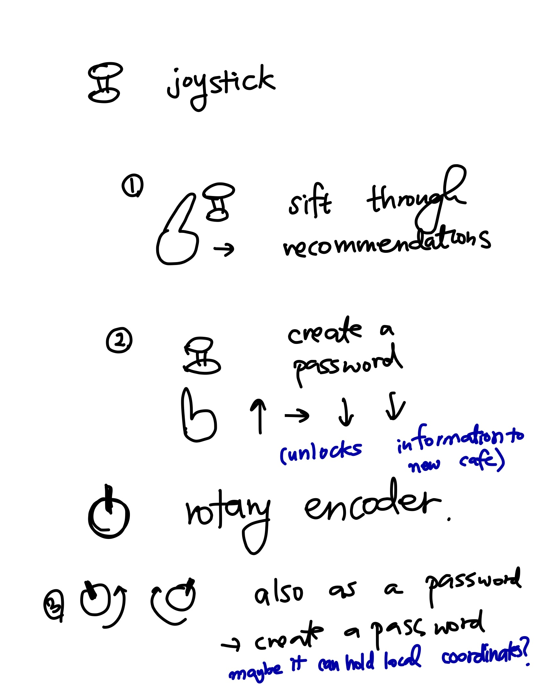
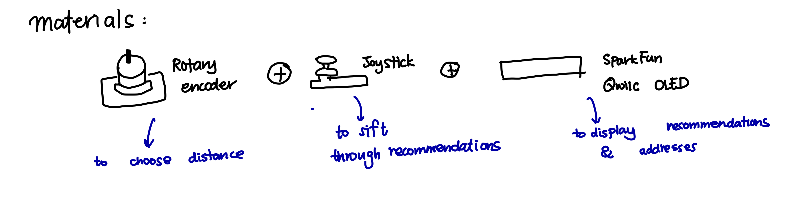
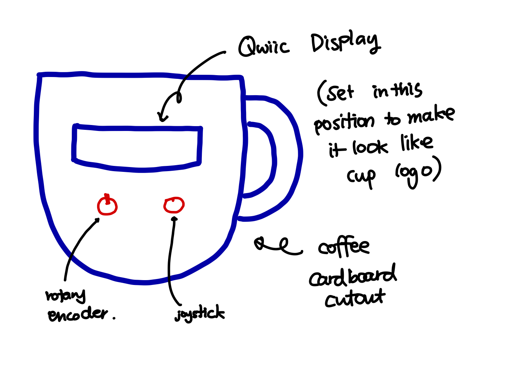
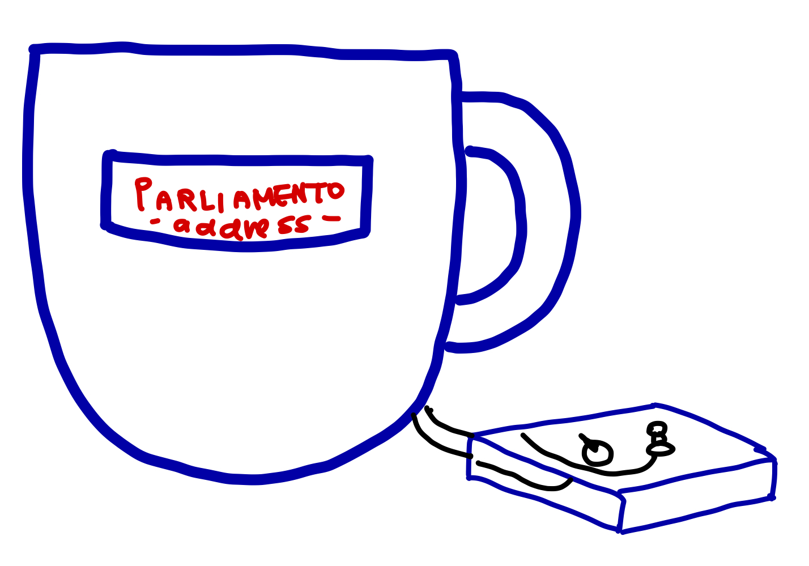
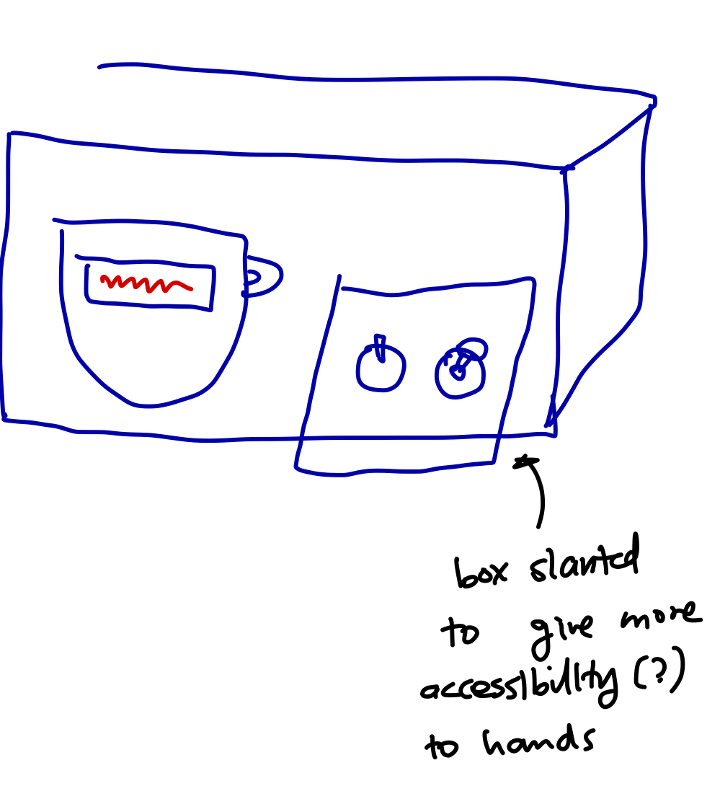
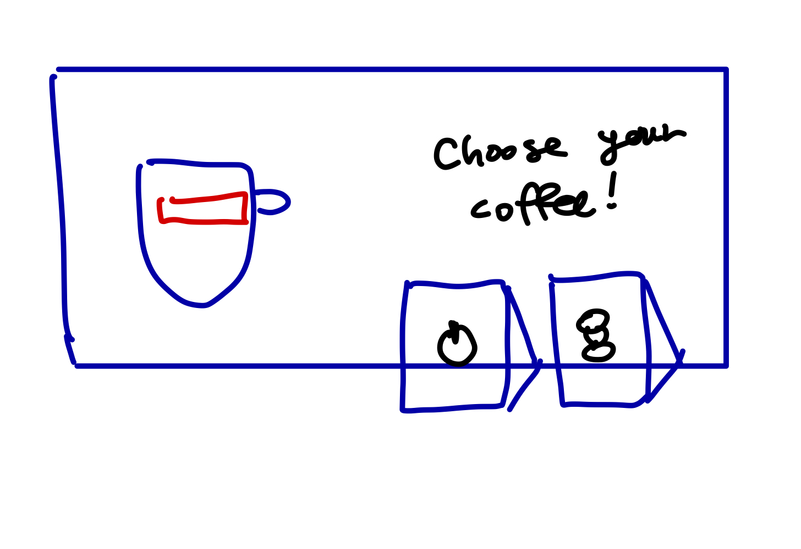
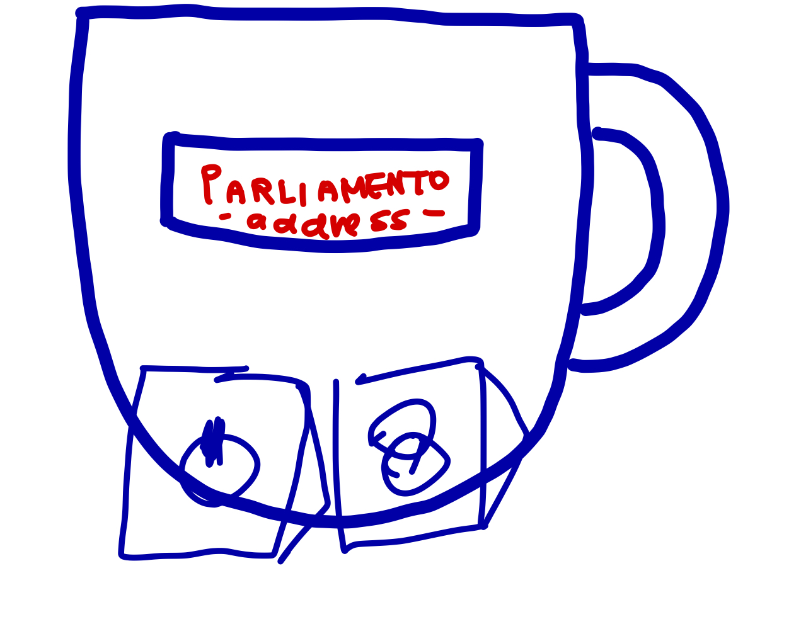
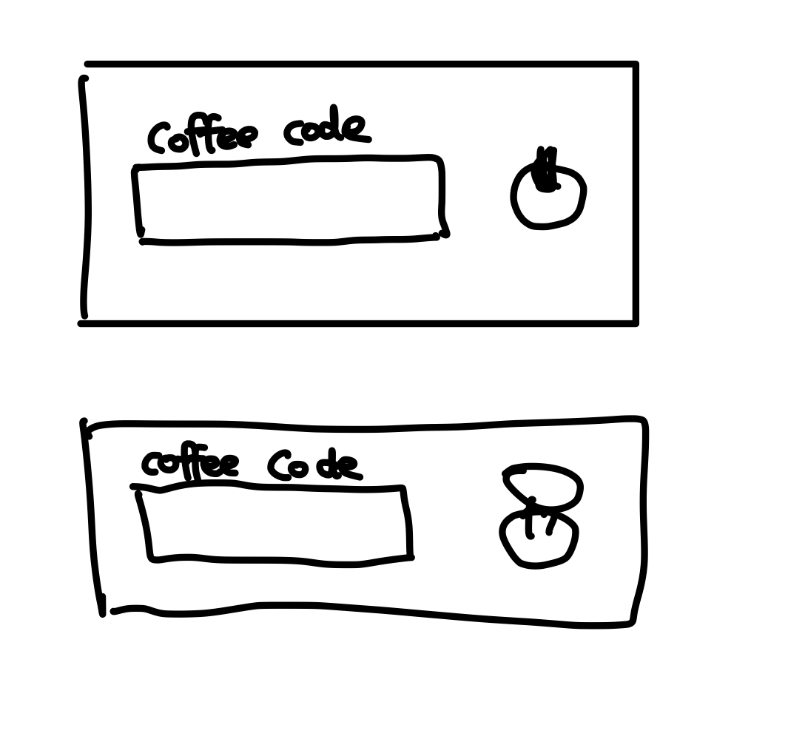
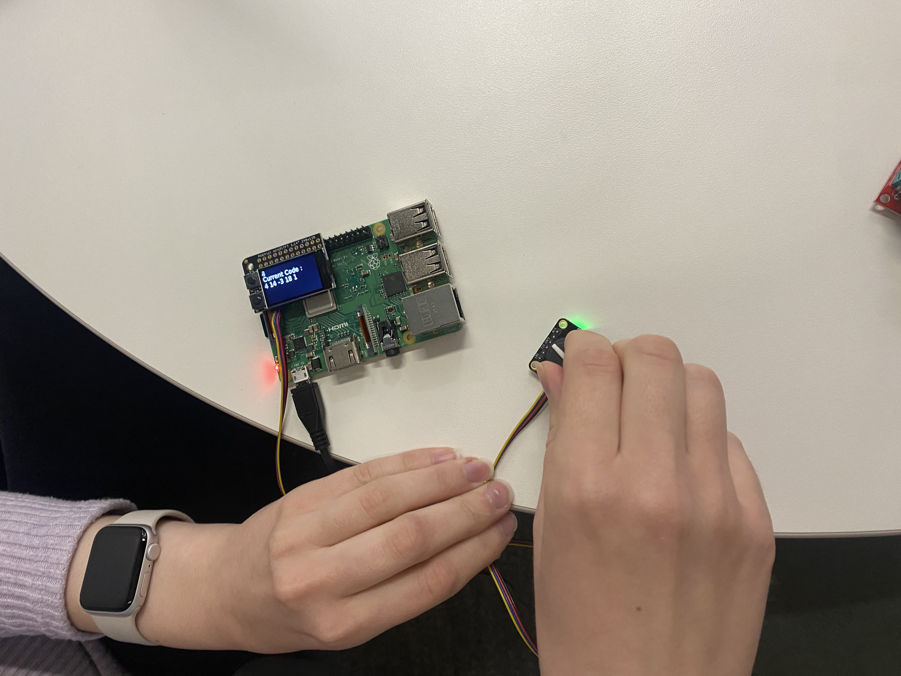
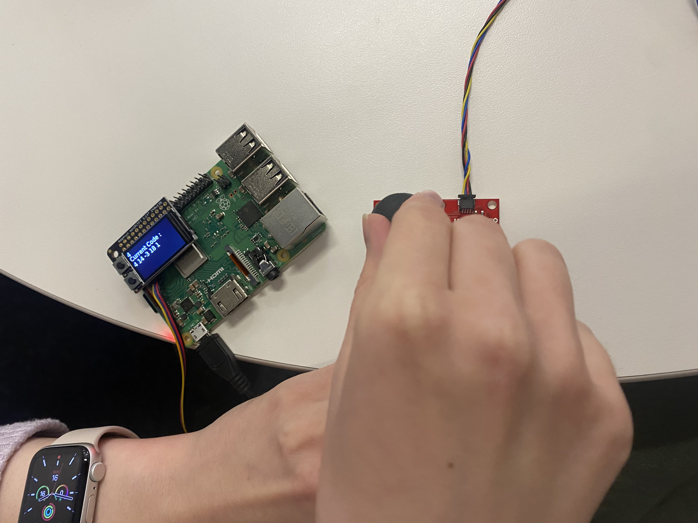

# Ph-UI!!!

**NAMES OF COLLABORATORS HERE**


For lab this week, we focus both on sensing, to bring in new modes of input into your devices, as well as prototyping the physical look and feel of the device. You will think about the physical form the device needs to perform the sensing as well as present the display or feedback about what was sensed. 

## Part 1 Lab Preparation

### Get the latest content:
As always, pull updates from the class Interactive-Lab-Hub to both your Pi and your own GitHub repo. As we discussed in the class, there are 2 ways you can do so:

**\[recommended\]**Option 1: On the Pi, `cd` to your `Interactive-Lab-Hub`, pull the updates from upstream (class lab-hub) and push the updates back to your own GitHub repo. You will need the personal access token for this.

```
pi@ixe00:~$ cd Interactive-Lab-Hub
pi@ixe00:~/Interactive-Lab-Hub $ git pull upstream Fall2022
pi@ixe00:~/Interactive-Lab-Hub $ git add .
pi@ixe00:~/Interactive-Lab-Hub $ git commit -m "get lab4 content"
pi@ixe00:~/Interactive-Lab-Hub $ git push
```

Option 2: On your your own GitHub repo, [create pull request](https://github.com/FAR-Lab/Developing-and-Designing-Interactive-Devices/blob/2021Fall/readings/Submitting%20Labs.md) to get updates from the class Interactive-Lab-Hub. After you have latest updates online, go on your Pi, `cd` to your `Interactive-Lab-Hub` and use `git pull` to get updates from your own GitHub repo.

### Start brasinstorming ideas by reading: 
* [What do prototypes prototype?](https://www.semanticscholar.org/paper/What-do-Prototypes-Prototype-Houde-Hill/30bc6125fab9d9b2d5854223aeea7900a218f149)
* [Paper prototyping](https://www.uxpin.com/studio/blog/paper-prototyping-the-practical-beginners-guide/) is used by UX designers to quickly develop interface ideas and run them by people before any programming occurs. 
* [Cardboard prototypes](https://www.youtube.com/watch?v=k_9Q-KDSb9o) help interactive product designers to work through additional issues, like how big something should be, how it could be carried, where it would sit. 
* [Tips to Cut, Fold, Mold and Papier-Mache Cardboard](https://makezine.com/2016/04/21/working-with-cardboard-tips-cut-fold-mold-papier-mache/) from Make Magazine.
* [Surprisingly complicated forms](https://www.pinterest.com/pin/50032245843343100/) can be built with paper, cardstock or cardboard.  The most advanced and challenging prototypes to prototype with paper are [cardboard mechanisms](https://www.pinterest.com/helgangchin/paper-mechanisms/) which move and change. 
* [Dyson Vacuum Cardboard Prototypes](http://media.dyson.com/downloads/JDF/JDF_Prim_poster05.pdf)
<p align="center"> </p>

### Gathering materials for this lab:

* Cardboard (start collecting those shipping boxes!)
* Found objects and materials--like bananas and twigs.
* Cutting board
* Cutting tools
* Markers

(We do offer shared cutting board, cutting tools, and markers on the class cart during the lab, so do not worry if you don't have them!)

## Deliverables \& Submission for Lab 4

The deliverables for this lab are, writings, sketches, photos, and videos that show what your prototype:
* "Looks like": shows how the device should look, feel, sit, weigh, etc.
* "Works like": shows what the device can do.
* "Acts like": shows how a person would interact with the device.

For submission, the readme.md page for this lab should be edited to include the work you have done:
* Upload any materials that explain what you did, into your lab 4 repository, and link them in your lab 4 readme.md.
* Link your Lab 4 readme.md in your main Interactive-Lab-Hub readme.md. 
* Group members can turn in one repository, but make sure your Hub readme.md links to the shared repository.
* Labs are due on Mondays, make sure to submit your Lab 4 readme.md to Canvas.


## Lab Overview

A) [Capacitive Sensing](#part-a)

B) [OLED screen](#part-b) 

C) [Paper Display](#part-c)

D) [Materiality](#part-d)

E) [Servo Control](#part-e)

F) [Record the interaction](#part-f)

## The Report (Part 1: A-D, Part 2: E-F)

### Part A
### Capacitive Sensing, a.k.a. Human-Twizzler Interaction 

We want to introduce you to the [capacitive sensor](https://learn.adafruit.com/adafruit-mpr121-gator) in your kit. It's one of the most flexible input devices we are able to provide. At boot, it measures the capacitance on each of the 12 contacts. Whenever that capacitance changes, it considers it a user touch. You can attach any conductive material. In your kit, you have copper tape that will work well, but don't limit yourself! In the example below, we use Twizzlers--you should pick your own objects.


<p float="left">


</p>

Plug in the capacitive sensor board with the QWIIC connector. Connect your Twizzlers with either the copper tape or the alligator clips (the clips work better). In this lab, we will continue to use the `circuitpython` virtual environment we created before. Activate `circuitpython` and `cd` to your Lab 4 folder to install the requirements by:

```
(circuitpython) pi@ixe00:~/Interactive-Lab-Hub/Lab 4 $ pip3 install -r requirements.txt
```


These Twizzlers are connected to pads 6 and 10. When you run the code and touch a Twizzler, the terminal will print out the following

```
(circuitpython) pi@ixe00:~/Interactive-Lab-Hub/Lab 4 $ python cap_test.py 
Twizzler 10 touched!
Twizzler 6 touched!
```

### Part B
### More sensors

#### Light/Proximity/Gesture sensor (APDS-9960)

We here want you to get to know this awesome sensor [Adafruit APDS-9960](https://www.adafruit.com/product/3595). It is capable of sensing proximity, light (also RGB), and gesture! 


Connect it to your pi with Qwiic connector and try running the three example scripts individually to see what the sensor is capable of doing!

```
(circuitpython) pi@ixe00:~/Interactive-Lab-Hub/Lab 4 $ python proximity_test.py
...
(circuitpython) pi@ixe00:~/Interactive-Lab-Hub/Lab 4 $ python gesture_test.py
...
(circuitpython) pi@ixe00:~/Interactive-Lab-Hub/Lab 4 $ python color_test.py
...
```

You can go the the [Adafruit GitHub Page](https://github.com/adafruit/Adafruit_CircuitPython_APDS9960) to see more examples for this sensor!

#### Rotary Encoder

A rotary encoder is an electro-mechanical device that converts the angular position to analog or digital output signals. The [Adafruit rotary encoder](https://www.adafruit.com/product/4991#technical-details) we ordered for you came with separated breakout board and encoder itself, that is, they will need to be soldered if you have not yet done so! We will be bringing the soldering station to the lab class for you to use, also, you can go to the MakerLAB to do the soldering off-class. Here is some [guidance on soldering](https://learn.adafruit.com/adafruit-guide-excellent-soldering/preparation) from Adafruit. When you first solder, get someone who has done it before (ideally in the MakerLAB environment). It is a good idea to review this material beforehand so you know what to look at.

<p float="left">


</p>

Connect it to your pi with Qwiic connector and try running the example script, it comes with an additional button which might be useful for your design!

```
(circuitpython) pi@ixe00:~/Interactive-Lab-Hub/Lab 4 $ python encoder_test.py
```

You can go to the [Adafruit Learn Page](https://learn.adafruit.com/adafruit-i2c-qt-rotary-encoder/python-circuitpython) to learn more about the sensor! The sensor actually comes with an LED (neo pixel): Can you try lighting it up? 

#### Joystick

A [joystick](https://www.sparkfun.com/products/15168) can be used to sense and report the input of the stick for it pivoting angle or direction. It also comes with a button input!

<p float="left">

</p>

Connect it to your pi with Qwiic connector and try running the example script to see what it can do!

```
(circuitpython) pi@ixe00:~/Interactive-Lab-Hub/Lab 4 $ python joystick_test.py
```

You can go to the [SparkFun GitHub Page](https://github.com/sparkfun/Qwiic_Joystick_Py) to learn more about the sensor!

#### Distance Sensor

Earlier we have asked you to play with the proximity sensor, which is able to sense object within a short distance. Here, we offer [Qwiic Multi Distance Sensor](https://www.sparkfun.com/products/17072), which has a field of view of about 25° and is able to detect objects up to 3 meters away! 

<p float="left">

</p>

Connect it to your pi with Qwiic connector and try running the example script to see how it works!

```
(circuitpython) pi@ixe00:~/Interactive-Lab-Hub/Lab 4 $ python distance_test.py
```

You can go to the [SparkFun GitHub Page](https://github.com/sparkfun/Qwiic_VL53L1X_Py) to learn more about the sensor and see other examples!

### Part C
### Physical considerations for sensing

Usually, sensors need to positioned in specific locations or orientations to make them useful for their application. Now that you've tried a bunch of the sensors, pick one that you would like to use, and an application where you use the output of that sensor for an interaction. For example, you can use a distance sensor to measure someone's height if you position it overhead and get them to stand under it.

**\*\*\*Draw 5 sketches of different ways you might use your sensor, and how the larger device needs to be shaped in order to make the sensor useful.\*\*\***
I wanted to use the rotary encoder and the joystick and the small sensor. (I wanted to utilize as much sensors as possible)




More information and thoughts on sensor in the images. 


**\*\*\*What are some things these sketches raise as questions? What do you need to physically prototype to understand how to anwer those questions?\*\*\***

One thing is that the small sensors might be too small to display information.
It would help if the screen was bigger to hold both the name of the coffee shop
and the address so that they can visit it. 

One other question is will the user actually need all three, would it just be better to have one sensor and one display ? If the user doesn't seem to use three sensors, I will just remove one and simplify the process.

**\*\*\*Pick one of these designs to prototype.\*\*\***
I think I'm going to use both joystick and rotary encoder and the screen.
But if I cannot implement all three sensors, I'm going to use the rotary encoder & the screen. 

It might actually be better to just use two instead of three.
Because of complexity. But I will design sketches for three ensors.


### Part D
### Physical considerations for displaying information and housing parts


Here is an Pi with a paper faceplate on it to turn it into a display interface:


This is fine, but the mounting of the display constrains the display location and orientation a lot. Also, it really only works for applications where people can come and stand over the Pi, or where you can mount the Pi to the wall.

Here is another prototype for a paper display:


Your kit includes these [SparkFun Qwiic OLED screens](https://www.sparkfun.com/products/17153). These use less power than the MiniTFTs you have mounted on the GPIO pins of the Pi, but, more importantly, they can be more flexibily be mounted elsewhere on your physical interface. The way you program this display is almost identical to the way you program a  Pi display. Take a look at `oled_test.py` and some more of the [Adafruit examples](https://github.com/adafruit/Adafruit_CircuitPython_SSD1306/tree/master/examples).

<p float="left">


</p>


It holds a Pi and usb power supply, and provides a front stage on which to put writing, graphics, LEDs, buttons or displays.

This design can be made by scoring a long strip of corrugated cardboard of width X, with the following measurements:

| Y height of box <br> <sub><sup>- thickness of cardboard</sup></sub> | Z  depth of box <br><sub><sup>- thickness of cardboard</sup></sub> | Y height of box  | Z  depth of box | H height of faceplate <br><sub><sup>* * * * * (don't make this too short) * * * * *</sup></sub>|
| --- | --- | --- | --- | --- | 

Fold the first flap of the strip so that it sits flush against the back of the face plate, and tape, velcro or hot glue it in place. This will make a H x X interface, with a box of Z x X footprint (which you can adapt to the things you want to put in the box) and a height Y in the back. 

Here is an example:


Think about how you want to present the information about what your sensor is sensing! Design a paper display for your project that communicates the state of the Pi and a sensor. Ideally you should design it so that you can slide the Pi out to work on the circuit or programming, and then slide it back in and reattach a few wires to be back in operation.
 
**\*\*\*Sketch 5 designs for how you would physically position your display and any buttons or knobs needed to interact with it.\*\*\***

**\*\*\*What are some things these sketches raise as questions? What do you need to physically prototype to understand how to anwer those questions?\*\*\***

I will answer these two questions together. The reason for this is, I improved my design gradually (5 iterations for 5 designs) by asking these questions after each iteration.

While I was thinking of an idea that I wanted to use for my Interactive Device. I realized that I desparately needed some coffee. 

One thing I miss about Korea most is their $1 coffee drinks.
& I also really miss being able to explore cafes. 

Exploring cafes was something I was really passionate about, to the point where I would make blogs about recommended cafes or study places. 

New York, although it is very accessible, lacks a great platform that recommends a good coffee place or a good place to study.

I decided to come up with a cafe recommending system. 



I chose these three materials because I needed to have it complete the following functions. 

1. Choose Distance
2. Go through the recommendations
3. Display the Recommendations. 

I needed a sensor that could set the limit for how far the cafe can be to where I am. I did think of using a joystick or a distane sensor, but I thought that the most intuitive way to implement this was to use the Rotary encoder.
This sensor gives the user the most control over deciding the limit.

The joystick would be the best in going through the recommendations. If the display had touch sensors, then i would rethink the joystick, but because we don't have that option, I went with the joystick. 

I chose the SparkFun Qwicc OLED because I liked the slick display.
Nothing more, just the slick display.




Question 1 ) Love the cute design, but wouldn't the position of the rotary encoder and the joystick cause some difficulty in using it? 

Answer: Yes. Create a separate cardboard interface for the joystick and the encoder. 

Question 2) Do you think it would be a good idea to make this portable? 

Answer: No. They might accidentally mess with the rotary encoder and the joystick. 



Question 1) Will the wires cause some physical difficulties ? 

Answer : It will cause some difficulties in making the device easy to move. 

Question 2) Is there a way to make this more presentable ? with the presence of wires, and other sensors.



Question 1) How thin is the box? Is it better to have a thin box or a thick box ? 

Answer: It's best to have an appropriate width : not to thick and not to thin. 

Question 2) Is the distance between the joystick and the rotary encoder put apart so that they don't make the UX experience difficult ? Would there be a better layout ? 




I still liked the coffee cutout better. & I also thought the layout would be better if the display was on the top of the two sensors.




**\*\*\*Pick one of these display designs to integrate into your prototype.\*\*\***


Chosen display 

**\*\*\*Explain the rationale for the design.\*\*\*** (e.g. Does it need to be a certain size or form or need to be able to be seen from a certain distance?)

When I designed this, I went through 5 iterations and decided that the last design was the most appropriate. 

The reason for this is : 

1. I wanted to explore with the laser cutter. So I didn't want a simple cardboard box. That is why I stuck with the coffee cup design. Plus, I think it's much cuter. 

2. I wanted the display on top of the sensors. I thought that that would make the it easier for them to have the whole thing in one glance. 

3. I separated the box that the sensors were placed. This was to make sure that the user doesnt touch the other sensor on accident.


**\*\*\*Document your rough prototype.\*\*\***
Before I built the prototype and the program, I first sat down with my roommates & friend and asked how they would like to use the recommendation program. 

This conversation kind of sidetracked and went on to discuss about how it was kind of difficult to give simple gifts and coupons for a drink here in America. (It was much simpler in Korea. ) This kind of led to another idea of creating a coffee coupon device.

By using the joystick or the encoder, you can put in a secret code that would give you an exclusive coupon sent by the gift-er. 

The questions that were raised was, do we need both the joystick and the encoder ? 
Which sensor would be more useful ? 



In order to answer this question, I tested out whether the user liked the encoder or the joystick better




Most of the users said that they prefer the encoder better


https://user-images.githubusercontent.com/49267393/196066486-4902ae31-eee8-484a-acc1-9cc189d98eb4.MOV

I decided to use the encoder to put in the code. 
The users can press the encoder to signal that they selected a number

The main problem now would be how to position the encoder.
I wanted to use the "coupon-book" design so I cutout a cardboard


https://user-images.githubusercontent.com/49267393/196067499-07ff58a2-832a-4635-a2d0-1f3739828cec.mov

And then I cut out a piece of card board as the window for the device and I taped it to the back of the coupon-book.


**\*\*\*Build a cardbord prototype of your design.\*\*\***


https://user-images.githubusercontent.com/49267393/196067384-fab208b5-60d5-46da-a87c-6ed837a108e0.mov


## LAB PART 2

### Part 2

Following exploration and reflection from Part 1, complete the "looks like," "works like" and "acts like" prototypes for your design, reiterated below.


### Part F
### Record

Document all the prototypes and iterations you have designed and worked on! Again, deliverables for this lab are writings, sketches, photos, and videos that show what your prototype:
* "Looks like": shows how the device should look, feel, sit, weigh, etc.
* "Works like": shows what the device can do
* "Acts like": shows how a person would interact with the device

