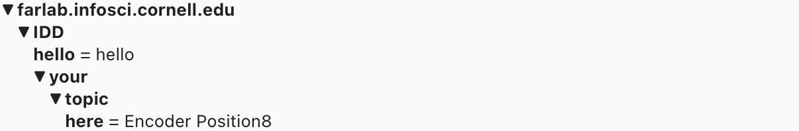
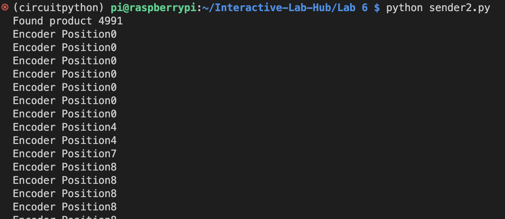
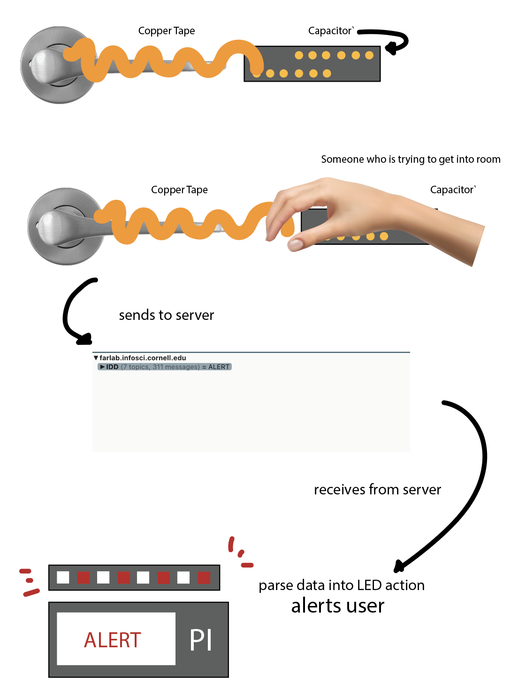

# Little Interactions Everywhere

**NAMES OF COLLABORATORS HERE**
James Donnelly

## Prep

1. Pull the new changes from the class interactive-lab-hub. (You should be familiar with this already!)
2. Install [MQTT Explorer](http://mqtt-explorer.com/) on your laptop.
3. Readings before class:
   * [MQTT](#MQTT)
   * [The Presence Table](https://dl.acm.org/doi/10.1145/1935701.1935800) and [video](https://vimeo.com/15932020)


## Overview

The point of this lab is to introduce you to distributed interaction. We have included some Natural Language Processing (NLP) and Generation (NLG) but those are not really the emphasis. Feel free to dig into the examples and play around the code which you can integrate into your projects if wanted. However, we want to emphasize that the grading will focus on your ability to develop interesting uses for messaging across distributed devices. Here are the four sections of the lab activity:

A) [MQTT](#part-a)

B) [Send and Receive on your Pi](#part-b)

C) [Streaming a Sensor](#part-c)

D) [The One True ColorNet](#part-d)

E) [Make It Your Own](#part-)

## Part 1.

### Part A
### MQTT

MQTT is a lightweight messaging portal invented in 1999 for low bandwidth networks. It was later adopted as a defacto standard for a variety of [Internet of Things (IoT)](https://en.wikipedia.org/wiki/Internet_of_things) devices. 

#### The Bits

* **Broker** - The central server node that receives all messages and sends them out to the interested clients. Our broker is hosted on the far lab server (Thanks David!) at `farlab.infosci.cornell.edu/8883`. Imagine that the Broker is the messaging center!
* **Client** - A device that subscribes or publishes information to/on the network.
* **Topic** - The location data gets published to. These are *hierarchical with subtopics*. For example, If you were making a network of IoT smart bulbs this might look like `home/livingroom/sidelamp/light_status` and `home/livingroom/sidelamp/voltage`. With this setup, the info/updates of the sidelamp's `light_status` and `voltage` will be store in the subtopics. Because we use this broker for a variety of projects you have access to read, write and create subtopics of `IDD`. This means `IDD/ilan/is/a/goof` is a valid topic you can send data messages to.
*  **Subscribe** - This is a way of telling the client to pay attention to messages the broker sends out on the topic. You can subscribe to a specific topic or subtopics. You can also unsubscribe. Following the previouse example of home IoT smart bulbs, subscribing to `home/livingroom/sidelamp/#` would give you message updates to both the light_status and the voltage.
* **Publish** - This is a way of sending messages to a topic. Again, with the previouse example, you can set up your IoT smart bulbs to publish info/updates to the topic or subtopic. Also, note that you can publish to topics you do not subscribe to. 


**Important note:** With the broker we set up for the class, you are limited to subtopics of `IDD`. That is, to publish or subcribe, the topics will start with `IDD/`. Also, setting up a broker is not much work, but for the purposes of this class, you should all use the broker we have set up for you!


#### Useful Tooling

Debugging and visualizing what's happening on your MQTT broker can be helpful. We like [MQTT Explorer](http://mqtt-explorer.com/). You can connect by putting in the settings from the image below.


Once connected, you should be able to see all the messages under the IDD topic. , go to the **Publish** tab and try publish something! From the interface you can send and plot messages as well. Remember, you are limited to subtopics of `IDD`. That is, to publish or subcribe, the topics will start with `IDD/`.


### Part B
### Send and Receive on your Pi

[sender.py](./sender.py) and and [reader.py](./reader.py) show you the basics of using the mqtt in python. Let's spend a few minutes running these and seeing how messages are transferred and shown up. Before working on your Pi, keep the connection of `farlab.infosci.cornell.edu/8883` with MQTT Explorer running on your laptop.

**Running Examples on Pi**

* Install the packages from `requirements.txt` under a virtual environment, we will continue to use the `circuitpython` environment we setup earlier this semester:
  ```
  pi@ixe00:~ $ source circuitpython/bin/activate
  (circuitpython) pi@ixe00:~ $ cd Interactive-Lab-Hub/Lab\ 6
  (circuitpython) pi@ixe00:~ Interactive-Lab-Hub/Lab 6 $ pip install -r requirements.txt
  ```
* Run `sender.py`, fill in a topic name (should start with `IDD/`), then start sending messages. You should be able to see them on MQTT Explorer.
  ```
  (circuitpython) pi@ixe00:~ Interactive-Lab-Hub/Lab 6 $ python sender.py
  pi@ReiIDDPi:~/Interactive-Lab-Hub/Lab 6 $ python sender.py
  >> topic: IDD/ReiTesting
  now writing to topic IDD/ReiTesting
  type new-topic to swich topics
  >> message: testtesttest
  ...
  ```
* Run `reader.py`, and you should see any messages being published to `IDD/` subtopics.
  ```
  (circuitpython) pi@ixe00:~ Interactive-Lab-Hub/Lab 6 $ python reader.py
  ...
  ```

**\*\*\*Consider how you might use this messaging system on interactive devices, and draw/write down 5 ideas here.\*\*\***

1. At the hospital, when nurses might want to ping doctors with information about patients coming in. 

2. Teachers when they want to silently communicate to their students that they want to have a word with them outside of class, perhaps to talk about a concerning behavior. 

3. At coffee shops/bars: Customers take a device, put in a drink that they want, and then baristas can notify them when their drink is ready. 

4. Morse Code for kids. You can connect a joystick or button to the pi and have one kid send more code and have the other kid accept it as a decoded message.

5. A cheap alternative to Apple Tags: Attach it to your wallet or your phone with a GPS system. When you lose your item, you an have it message you the location of where it is in . 

### Part C
### Streaming a Sensor

We have included an updated example from [lab 4](https://github.com/FAR-Lab/Interactive-Lab-Hub/tree/Fall2021/Lab%204) that streams the [capacitor sensor](https://learn.adafruit.com/adafruit-mpr121-gator) inputs over MQTT. We will also be running this example under `circuitpython` virtual environment.

Plug in the capacitive sensor board with the Qwiic connector. Use the alligator clips to connect a Twizzler (or any other things you used back in Lab 4) and run the example script:

<p float="left">


</p>


 ```
 (circuitpython) pi@ixe00:~ Interactive-Lab-Hub/Lab 6 $ python distributed_twizzlers_sender.py
 ...
 ```


**\*\*\*Include a picture of your setup here: what did you see on MQTT Explorer?\*\*\***


I didn't have twizzlers so I just set it up like this. 


This is the result of the MQTT Explorer

**\*\*\*Pick another part in your kit and try to implement the data streaming with it.\*\*\***

I chose the rotary encoder to implement the data.

 ```
while True:
	position = -encoder.position
	val = "Encoder Position" + str(position)
	print(val)
	client.publish(topic,val)
	time.sleep(0.25)
```
I wrote it to publish the encoder position 




### Part D
### The One True ColorNet

It is with great fortitude and resilience that we shall worship at the altar of the *OneColor*. Through unity of the collective RGB, we too can find unity in our heart, minds and souls. With the help of machines, we can overthrow the bourgeoisie, get on the same wavelength (this was also a color pun) and establish [Fully Automated Luxury Communism](https://en.wikipedia.org/wiki/Fully_Automated_Luxury_Communism).

The first step on the path to *collective* enlightenment, plug the [APDS-9960 Proximity, Light, RGB, and Gesture Sensor](https://www.adafruit.com/product/3595) into the [MiniPiTFT Display](https://www.adafruit.com/product/4393). You are almost there!

<p float="left">
  
  
  
</p>


The second step to achieving our great enlightenment is to run `color.py`. We have talked about this sensor back in Lab 2 and Lab 4, this script is similar to what you have done before! Remember to ativate the `circuitpython` virtual environment you have been using during this semester before running the script:

 ```
 (circuitpython) pi@ixe00:~ Interactive-Lab-Hub/Lab 6 $ python color.py
 ...
 ```

By running the script, wou will find the two squares on the display. Half is showing an approximation of the output from the color sensor. The other half is up to the collective. Press the top button to share your color with the class. Your color is now our color, our color is now your color. We are one.

(A message from the previous TA, Ilan: I was not super careful with handling the loop so you may need to press more than once if the timing isn't quite right. Also, I haven't load-tested it so things might just immediately break when everyone pushes the button at once.)

You may ask "but what if I missed class?" Am I not admitted into the collective enlightenment of the *OneColor*?

Of course not! You can go to [https://one-true-colornet.glitch.me/](https://one-true-colornet.glitch.me/) and become one with the ColorNet on the inter-webs. Glitch is a great tool for prototyping sites, interfaces and web-apps that's worth taking some time to get familiar with if you have a chance. Its not super pertinent for the class but good to know either way. 

**\*\*\*Can you set up the script that can read the color anyone else publish and display it on your screen?\*\*\***

 ```
import board
import busio
import adafruit_apds9960.apds9960
import time
import paho.mqtt.client as mqtt
import uuid
import signal

import digitalio
from PIL import Image, ImageDraw, ImageFont
import adafruit_rgb_display.st7789 as st7789


# Configuration for CS and DC pins (these are FeatherWing defaults on M0/M4):
cs_pin = digitalio.DigitalInOut(board.CE0)
dc_pin = digitalio.DigitalInOut(board.D25)
reset_pin = None

# Config for display baudrate (default max is 24mhz):
BAUDRATE = 64000000

backlight = digitalio.DigitalInOut(board.D22)
backlight.switch_to_output()
backlight.value = True
buttonA = digitalio.DigitalInOut(board.D23)
buttonB = digitalio.DigitalInOut(board.D24)
buttonA.switch_to_input()
buttonB.switch_to_input()

# Setup SPI bus using hardware SPI:
spi = board.SPI()

# Create the ST7789 display:
disp = st7789.ST7789(
    spi,
    cs=cs_pin,
    dc=dc_pin,
    rst=reset_pin,
    baudrate=BAUDRATE,
    width=135,
    height=240,
    x_offset=53,
    y_offset=40,
)

height =  disp.height
width = disp.width 
image = Image.new("RGB", (width, height))
draw = ImageDraw.Draw(image)


i2c = busio.I2C(board.SCL, board.SDA)
sensor = adafruit_apds9960.apds9960.APDS9960(i2c)

sensor.enable_color = True
r, g, b, a = sensor.color_data

topic = 'IDD/colors'

def on_connect(client, userdata, flags, rc):
    print(f"connected with result code {rc}")
    client.subscribe(topic)

def on_message(client, userdata, msg):
    # if a message is recieved on the colors topic, parse it and set the color
    if msg.topic == topic:
        colors = list(map(int, msg.payload.decode('UTF-8').split(',')))
        print(colors)
        colorval = "#%02x%02x%02x" % (colors[0], colors[1], colors[2])
        draw.rectangle((0, 0, width, height*0.5), fill=colorval)
        disp.image(image)

client = mqtt.Client(str(uuid.uuid1()))
client.tls_set()
client.username_pw_set('idd', 'device@theFarm')
client.on_connect = on_connect
client.on_message = on_message

client.connect(
    'farlab.infosci.cornell.edu',
    port=8883)

client.loop_start()

# this lets us exit gracefully (close the connection to the broker)
def handler(signum, frame):
    print('exit gracefully')
    client.loop_stop()
    exit (0)

# hen sigint happens, do the handler callback function
signal.signal(signal.SIGINT, handler)

# our main loop
while True:
    r, g, b, a = sensor.color_data
    
    # there's a few things going on here 
    # colors are reported at 16bits (thats 65536 levels per color).
    # we need to convert that to 0-255. thats what the 255*(x/65536) is doing
    # color are also reported with an alpha (opacity, or in our case a proxy for ambient brightness)
    # 255*(1-(a/65536)) acts as scaling factor for brightness, it worked well enough in the lab but 
    # your success may vary depenging on how much ambient light there is, you can mess with these constants
    color =tuple(map(lambda x: int(255*(1-(a/65536))*255*(x/65536)) , [r,g,b,a]))

    # if we press the button, send msg to cahnge everyones color
    if not buttonA.value:
        client.publish(topic, f"{r},{g},{b}")
    if not buttonB.value:
        on_message
    draw.rectangle((0, height*0.5, width, height), fill=color[:3])
    disp.image(image)
    time.sleep(.01)
 ```

 

 
 
 


### Part E
### Make it your own

Find at least one class (more are okay) partner, and design a distributed application together based on the exercise we asked you to do in this lab.

**\*\*\*1. Explain your design\*\*\*** For example, if you made a remote controlled banana piano, explain why anyone would want such a thing.

"Touch-Security" 
The capactive sensor will be attached to the door knob and the pi will sense whenever someone touches the pi, send the information over to the receiver pi (in this case, the user), and the user will be alerted when someone trespasses into their room. 


**\*\*\*2. Diagram the architecture of the system.\*\*\*** Be clear to document where input, output and computation occur, and label all parts and connections. For example, where is the banana, who is the banana player, where does the sound get played, and who is listening to the banana music?

 
 

**\*\*\*3. Build a working prototype of the system.\*\*\*** Do think about the user interface: if someone encountered these bananas somewhere in the wild, would they know how to interact with them? Should they know what to expect?

**\*\*\*4. Document the working prototype in use.\*\*\*** It may be helpful to record a Zoom session where you should the input in one location clearly causing response in another location.


<!--**\*\*\*5. BONUS (Wendy didn't approve this so you should probably ignore it)\*\*\*** get the whole class to run your code and make your distributed system BIGGER.-->

